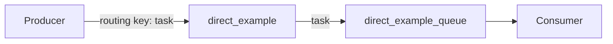
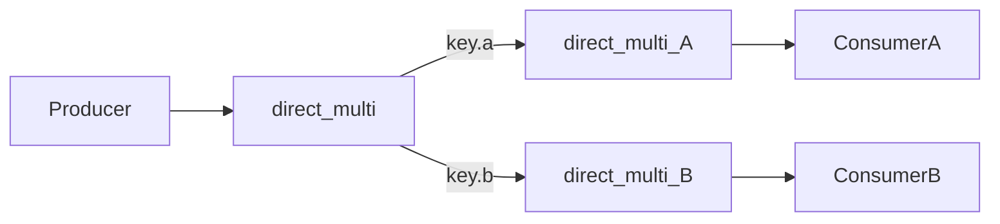
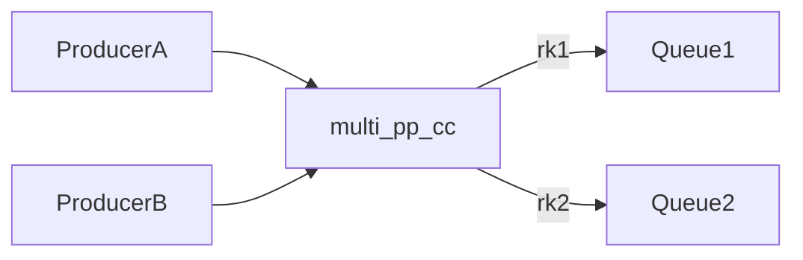
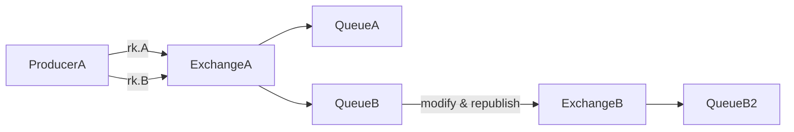
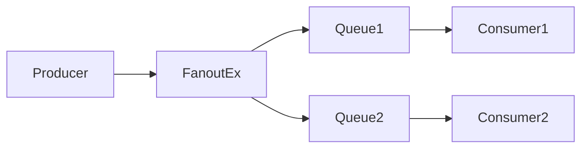
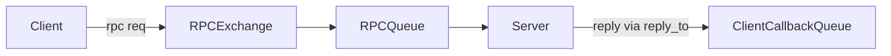
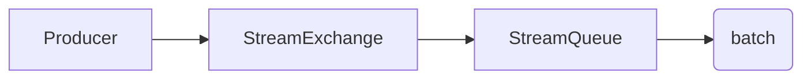

# RabbitMQ Python Tutorial (Beginner → Advanced)

This repository contains hands-on RabbitMQ examples in Python using `pika`.

Structure
- `src/` — core helper and example modules
- `src/generated/` — auto-generated modules (09-50)

Quick start
1. Install RabbitMQ and ensure it's running on `localhost:5672`.
2. Create a virtualenv and install deps:

```bash
python -m venv .venv
.venv\Scripts\activate
pip install -r requirements.txt
```

Running examples
- Basic direct exchange producer/consumer:

```bash
python -m src.module_01_direct_single produce
python -m src.module_01_direct_single consume
```

- Generate the additional modules (09-50):

```bash
python -m src.generate_modules
```

Mermaid diagrams (core modules)

**Module 01 Direct**:



**Module 02 Multi Consumer (direct)**:



**Module 03 Multi P->P C**:



**Module 04 Complex routing**:



**Module 05 Fanout**:



**Module 06 Dead Letter**:

```mermaid
flowchart LR
    Producer --> MainExchange
    MainExchange --> MainQueue
    MainQueue -.reject./expire.-> DLX[DeadLetterEx]
    DLX --> DeadQueue
```

**Module 07 RPC**:



**Module 08 Stream (simplified)**:



Generated modules (09-50)
- `src/generated/` contains programmatically generated examples covering variations in routing keys, exchanges, and durability. Run `python -m src.generate_modules` to recreate.

Notes & production tips
- Use connection pools or long-lived connections in production.
- Set `durable=True` on exchanges/queues and persistent delivery_mode=2 for messages that must survive broker restarts.
- Monitor queue lengths and set appropriate prefetch counts.
- Use Dead-Letter Exchanges for retries and failed message handling.
- For high-throughput streaming consider RabbitMQ Streams plugin.

If you want, I can:
- Run the generator now and add a short script to run arbitrary module by name.
- Expand individual modules into fully runnable Docker-compose + tests.

Files created:
- `src/rabbitmq_helper.py`
- `src/module_01_direct_single.py` ... `src/module_08_stream.py`
- `src/generate_modules.py`
- `requirements.txt`
