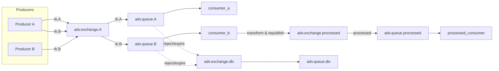

# RabbitMQ Advanced Complex Pipeline

This repository focuses on one advanced, production-style RabbitMQ example housed in `src/book/module_advanced_complex`.

## What is included

- Multi-producer event consolidation using `adv.exchange.A`
- Routing by semantic keys: `rk.A` and `rk.B`
- Transform-and-forward processing via `consumer_b`
- Final processed delivery through `adv.exchange.processed`
- Dead-letter capture for failures in `adv.exchange.dlx`

## Architecture overview



## Run the advanced example

```bash
python -m src.book.module_advanced_complex.setup
python -m src.book.module_advanced_complex.consumer_a
python -m src.book.module_advanced_complex.consumer_b
python -m src.book.module_advanced_complex.processed_consumer
python -m src.book.module_advanced_complex.producer_a produce
python -m src.book.module_advanced_complex.producer_b produce
```

## More details

See `src/book/module_advanced_complex/README.md` for the complete use case, topology labels, and implementation guidance.

## Notes

This top-level README is intentionally short and introductory. The module README contains the full advanced scenario description and commands.
