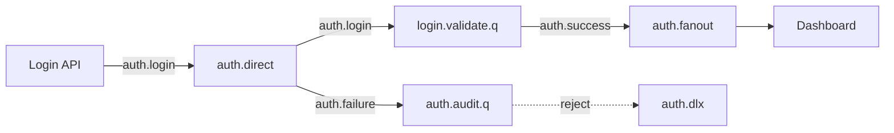
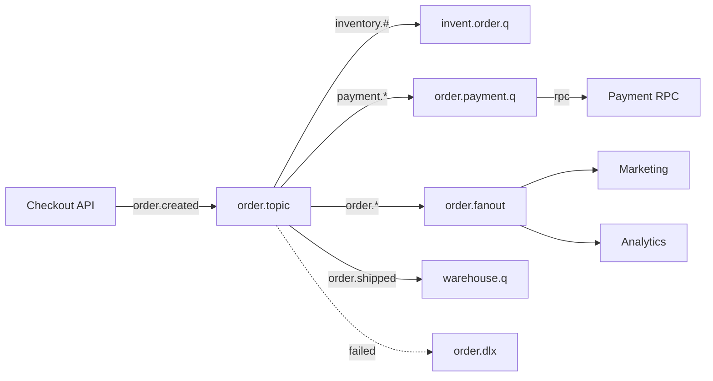
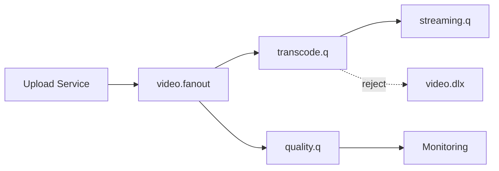
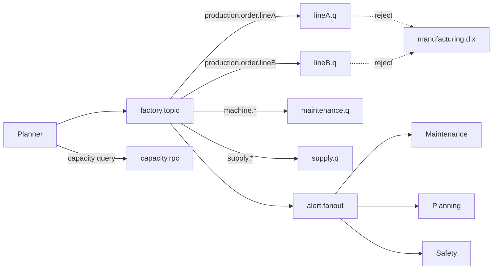
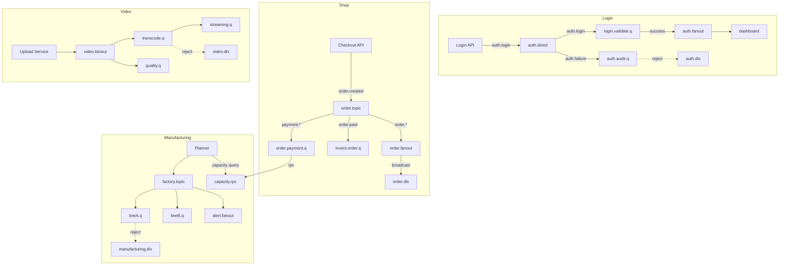

# Realistic RabbitMQ Architecture Guide

This README presents combined real-world queues and exchange patterns for four advanced application domains:
- webpage login
- online shopping
- video streaming
- manufacturing planning

Each scenario explains how queues are handled and how RabbitMQ exchange types are used to support reliability, fanout, routing, dead-letter handling, RPC, and streaming-style processing.

## 1. Webpage login flow

### Goal
Authenticate users, validate sessions, and notify downstream services without blocking the login request.

### Pattern
- `direct` exchange for `auth.login`, `auth.verify`, and `auth.audit` messages.
- `fanout` exchange for broadcasting session events to monitoring, analytics, and security subsystems.
- `dead-letter` queue for failed login attempts and suspicious traffic.

### Handling
1. The login API publishes an `auth.login` message to a direct exchange.
2. A dedicated login consumer validates credentials and publishes either `auth.success` or `auth.failure`.
3. `auth.success` is routed to the session manager queue, while `auth.failure` is routed to a separate audit queue.
4. A `fanout` exchange broadcasts successful session starts to real-time dashboards, security analytics, and notification services.
5. Failed attempts that exceed thresholds are rejected and forwarded to a dead-letter queue for investigation.

### Diagram

### Why this is realistic
- Login processing is latency-sensitive, so application servers hand off work to queues instead of waiting for downstream jobs.
- Fanout ensures observability and security monitoring receive the same event without coupling.
- Dead-letter handling isolates invalid traffic for later review.

## 2. Online shopping pipeline

### Goal
Process orders, apply promotions, update inventory, and deliver shipping instructions through resilient queue flows.

### Pattern
- `topic` exchange for order lifecycle events like `order.created`, `order.paid`, `order.shipped`.
- `direct` exchange for inventory and payment worker queues.
- `fanout` exchange for order notifications and analytics.
- `dead-letter` queue for failed payment or inventory reservation messages.
- `RPC` for synchronous stock validation and fraud checks.

### Handling
1. Checkout emits `order.created` and `payment.request` events into a topic exchange.
2. Inventory consumers bind to `inventory.#`, while shipment consumers bind to `order.shipped`.
3. Payment service uses an RPC pattern to request authorization and waits for the response before proceeding.
4. Once payment is confirmed, the order service publishes `order.paid`, which routes to inventory reservation and warehouse queues.
5. Promotion and analytics services receive the same order event through a fanout exchange for marketing and reporting.
6. If inventory or payment fails, the service rejects the message and sends it to a dead-letter queue for retry or manual recovery.

### Diagram

### Why this is realistic
- Online shops need event-driven workflows across multiple bounded contexts.
- Topic routing enables flexible subscription by business intent.
- RPC is used only for critical synchronous checks, while the rest remains asynchronous.

## 3. Video streaming event flow

### Goal
Coordinate stream ingestion, transcoding, analytics, and notification for live or on-demand video.

### Pattern
- `fanout` exchange for distributing ingest events to transcoding, quality monitoring, and CDN preparation.
- `direct` exchange for stage-specific workers like `transcode`, `thumbnaill`, `metadata`.
- `streaming`-style message batching with prefetch for high-throughput consumer groups.
- `dead-letter` queue for failed encoding tasks.

### Handling
1. A video upload or live session event is published to a `fanout` exchange.
2. Transcoding, thumbnail generation, and live metrics each receive the event independently through bound queues.
3. Transcoding workers use a direct exchange for different codec jobs and handle large payloads with higher prefetch settings.
4. Analytics consumers use stream-like batching to process viewer metrics and playback events efficiently.
5. Any video processing task that fails is rejected and routed to a dead-letter queue for manual retry or alerting.

### Diagram

### Why this is realistic
- Media pipelines are naturally branching, making fanout a good fit.
- High throughput requires consumer prefetch and batching to keep processing efficient.
- Dead-letter paths preserve failed media tasks without blocking the flow.

## 4. Manufacturing planning workflow

### Goal
Manage production orders, capacity planning, supply allocation, and exception handling across factory systems.

### Pattern
- `topic` exchange for messages such as `production.order`, `machine.status`, `supply.arrival`.
- `direct` exchange for work orders targeted at specific production lines.
- `fanout` exchange for broadcast alerts to maintenance, planning, and safety teams.
- `dead-letter` queue for invalid or unscheduled jobs.
- `RPC` for inventory reservation and line balancing requests.

### Handling
1. A new manufacturing order is published to a topic exchange with routing key `production.order.lineA`.
2. Planning systems subscribe to `production.order.*` and allocate work to specific line queues via a direct exchange.
3. Machine health and supply arrival events are also routed through topic bindings to the appropriate scheduler and maintenance queues.
4. Alerts are broadcast through a fanout exchange when a line is down, a supply shortage occurs, or an urgent order is added.
5. If a production request cannot be scheduled, the work item is rejected and moved to a dead-letter queue for manual planning.
6. For capacity decisions, a controller uses RPC to query current line availability and lock resources before confirming a new job.

### Diagram

### Why this is realistic
- Manufacturing needs both broad visibility and precise routing.
- Topic exchange supports complex event classification by product, line, or priority.
- RPC is appropriate for locking scarce resources without creating duplicate jobs.

## Combined architecture principles

These realistic examples share common RabbitMQ best practices:
- Use `direct` for explicit worker routing and task queues.
- Use `topic` for flexible event classification and subscription by patterns.
- Use `fanout` for broadcast-style notifications and observability.
- Use `dead-letter` queues for failure capture, retry, and manual intervention.
- Use `RPC` sparingly for synchronous checks that cannot be fully asynchronous.
- Use `streaming` or prefetch-based consumption for high-volume data flows.
- Keep queue topology durable and separate concerns across exchanges.

## Concept diagram

## How to use this guide

This document is intentionally conceptual. Use it to model real RabbitMQ architectures, choose exchange types for each domain, and align queue design with business process flow rather than specific code.

For a production design, map each system actor to a queue topology and validate failure paths with dead-letter exchanges and consumer retry policies.
